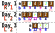

## 题目描述

小可可买来了一块长条状巧克力，共有 $n$ 格，每一格巧克力*美味度*为 $a_i$。

某一天她的*开心值*为 $p$，*幸运数*为 $x$，当天剩余的 $k$ 格巧克力*美味度*重新编号为 $a_0, a_1, \cdots, a_{k-1}$，小可可计算出第 $i$ 格巧克力的*契合度* $b_i$ 等于 $s_i \times s_{(i+p) \bmod k}$。

她打算从一端开始吃巧克力，直到**吃掉***契合度*为 $x$ 的格（**如果没有这样的格，那就吃完整个巧克力**）。但是她想少吃一点巧克力，于是她从第一天开始每天给你 $p,x$，你要回答她是从左边吃还是从右边吃更少，以及要吃多少个，或者报告巧克力被吃完了。**如果从左边吃和从右边吃，所吃的格数一样，那小可可更愿意从左边吃**。

## 输入格式

从文件 _eat.in_ 读取数据。

第一行一个正整数 $C$ 表示测试点编号。对于样例 1 满足 $C=0$。

第二行两个正整数 $n,m$。

接下来一行 $n$ 个正整数用空格隔开，第 $i$ 个数表示第 $i$ 个巧克力的美味度 $a_i$。

接下来 $m$ 行，每行两个非负整数 $p,x$，表示第 $1\sim m$ 天小可可给你的 $p,x$。

**保证小可可最早在第 $m$ 天吃光巧克力。**

## 输出格式

输出到文件 _eat.out_ 中。

共 $m$ 行，每行格式只能为以下几种中的一种：
+ `L `$x$：表示从左边吃 $x$ 格巧克力。
+ `R `$x$：表示从右边吃 $x$ 格巧克力。
+ `F`：表示吃完了。

## 样例 1 输入

```
0
6 4
2 3 4 3 2 3
2 9
1 12
4 6
114 514
```

## 样例 1 输出

```
R 1
L 2
L 2
F
```

## 样例 1 解释
|| 图左侧是每天你报告的信息。|
|:-:|:-|
|^|图右侧是每天巧克力的状态。|
|^|$a,b$ 与题意相同。|
|^|红色箭头是当天的吃法。|
|^|粉色数字表示契合度等于 $x$。|
|最后的 `F` 是显然的，只剩一格巧克力无论如何都被吃完。|<|

## 样例 $2 \sim 5$

见选手目录下的 _eat/eat\*.in_ 与 _eat/eat\*.ans_。

样例中的 $C$ 代表这组样例对应的实际测试点，其数据范围一致。

| 样例 | _2_ | _3_ | _4_ | _5_ |
|:-:|:-:|:-:|:-:|:-:|
| $C$ | $1$ | $2$ | $7$ | $9$ |

## 数据范围

对于所有测试数据，均有：$n,m,p \le 10^6$，$x \le 10^{18}$，$a_i \le 10^9$ 且都为非负整数。

| 测试点 | $n,m \le$ | 特殊性质 |
|:-:|:-:|:-:|
| $1$      | $10$          | 无 |
| $2\sim5$ | $5\times10^3$ | ^ |
| $6$      | $10^6$        | A |
| $7,8$    | ^             | B |
| $9,10$   | ^             | 无 |

特殊性质 A：所有 $a_i$ 均相等。

特殊性质 B：每天均有 $p=0$。