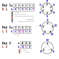

## 题目描述

小可可买来了一块长条状巧克力，将其横过来看，从左到右一共有 $n$ 格，每一格巧克力都有一个美味度 $a_i$。

小可可计划每天吃掉巧克力的左端或者右端的连续一部分。具体来说，她每天都有一个开心值 $p$，然后她会将剩余的巧克力的美味度从左至右顺时针首尾相接写成一个环，并计算第 $i$ 格巧克力与从这一格巧克力开始顺时针走 $p$ 格所到达的巧克力的美味度的乘积，作为第 $i$ 格巧克力今天的契合度 $b_i$。 *这也意味着每天每格巧克力的契合度都有可能与前一天不一样。* 接下来，她会在所有契合度中选择一个 $x$ 作为当天的幸运数。

|  | 图例为小可可计算当天契合度的方式，其中 $p=2$，内圈代表 $a$，外圈代表 $b$。 | 
|--|--|

小可可会确认当天契合度与幸运数相同的格之一为幸运格，然后从左端开始向右边或者从右端开始向左边一格一格吃巧克力，直到**吃完**幸运格。显然，幸运数确定之后，小可可仍有许多种吃法。但是，小可可希望每天吃尽可能少的巧克力，所以在这些吃法中，小可可会选择一个吃掉格数最少的吃法。特别地，**如果小可可当天有两种吃法都满足吃掉的格数最少，她优先选择从左端开始吃**。

小可可记录了前 $m$ 天中，她每天的开心值 $p$ 和幸运数 $x$，但是她已经忘了巧克力是怎样吃掉的了。请你帮助她回忆起她是如何吃光巧克力的吧！

## 输入格式

从文件 _eat.in_ 读取数据。

第一行一个正整数 $C$ 表示测试点编号。对于样例 1 满足 $C=0$。

第二行两个正整数 $n,m$。

接下来一行 $n$ 个正整数，第 $i$ 个正整数表示第 $i$ 个巧克力的美味度 $a_i$。

接下来 $m$ 行，每行两个正整数 $p,x$，表意如题。

## 输出格式

输出到文件 _eat.out_。

共 $m$ 行，每行为一个字符和一个数字，中间以空格隔开。其中前面的字符只可以为 `L` 或 `R`，表示这一次是从左边或右边开始吃的；后面的数字表示这一次一共吃了几格巧克力。

## 样例 1 输入

```
0
6 3
2 3 4 3 2 3
2 9
1 12
4 6
```

## 样例 1 输出

```
R 1
L 2
L 2
```

## 样例 1 解释

||
|-:|
|图例中右侧的边，浅蓝指向红代表将蓝数乘到红数上（可结合题意理解）。|

该样例中，第一天巧克力的契合度是 $\{8,9,8,9,4,9\}$，幸运格是第 $2,4,6$ 格，一共有 $6$ 种吃法。在这 $6$ 种吃法中，从右端开始向左吃到第 $6$ 格巧克力是吃得最少的吃法。

第二天巧克力契合度是 $\{6,12,12,6,4\}$，选择从左端开始向右吃到格 $2$ 是吃得最少的。

第三天巧克力契合度为 $\{12,6,8\}$，此时有两种吃法：从左端开始向右吃到格 $2$ 以及从右端开始向左吃到格 $2$，都是吃得最少的，根据规则小可可选择从左端开始吃巧克力，也就是从左端开始向右吃 $2$ 格。

## 样例 $2 \sim 8$

见选手目录下的 _eat/eat\*.in_ 与 _eat/eat\*.ans_。

样例中的 $C$ 代表这组样例对应的实际测试点，其数据范围一致。

| 样例 | _2_ | _3_ | _4_ | _5_ | _6_ | _7_ | _8_ |
|:-:|:-:|:-:|:-:|:-:|:-:|:-:|:-:|
| $C$ | $1$ | $2$ | $3$ | $5$ | $6$ | $9$ | $13$ |

## 数据范围

对于所有测试数据，均有：
- $1 \le n,m \le 10^6$；
- $0 \le p \le 10^6$；
- $1 \le x \le 10^{18}$；
- 对于所有 $i = 1, 2, \cdots, n$，均有 $1 \le a_i \le 10^9$。

| 测试点 | $n \le$ | $m \le$ | 特殊性质 |
|:-:|:-:|:-:|:-:|
| $1$         | $10$    | <      | 无 |
| $2$         | $10^3$  | $10^3$ | ^ |
| $3,4$       | $10^5$  | ^      | ^ |
| $5$         | $10^6$  | <      | A |
| $6\sim8$    | ^       | <      | B |
| $9\sim12$   | ^       | <      | C |
| $13\sim 20$ | ^       | <      | 无 |

特殊性质 A：所有 $a_i$ 均相等。

特殊性质 B：在最左边或者最右边 $10$ 块巧克力中，总是存在一块可行的巧克力。

特殊性质 C：对于所有询问，均有 $p=0$。